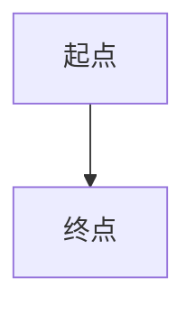

# 风格化复制真实 Pandoc 矩阵

前文 未保存 SELECTED 文本 后文。

[重复引用甲](https://example.com/资料)与[重复引用乙](https://example.com/资料)。

| 章节 | 状态 |
| --- | --- |
| 第一章 | 已完成 |
| 第二章 | 复核中 |

```typescript
const greeting: string = "你好，CJK_KNOWN_TOKEN";
```

```unknownlang
UNKNOWN_PLAIN_CJK_42("未知语言纯文本");
```

脚注引用保留静态来源[^static-note]。

[^static-note]: 脚注静态来源 CJK_FOOTNOTE_STATIC。

==重点标记 CJK_MARK==

行内数学 $E=mc^2$。

$$
\int_0^1 x^2\,dx
$$




